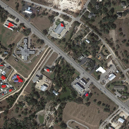

# Satellite Change Detection using Deep Learning

This project implements a **deep learning model for detecting changes
between multi-temporal satellite images**.\
Given two satellite images captured at different times, the model
predicts a **pixel-wise change map** highlighting areas where
significant changes occurred.

This technique is widely used in:

-   Remote sensing
-   Environmental monitoring
-   Urban expansion detection
-   Disaster damage assessment
-   Land-use analysis

------------------------------------------------------------------------

# Features

-   Automatic **LEVIR-CD dataset download**
-   **Siamese CNN / U-Net style architecture**
-   **IoU metric evaluation**
-   **GPU acceleration (CUDA support)**
-   **Training progress bars**
-   Automatic **visual result generation**
-   Research-style **change overlay visualization**

------------------------------------------------------------------------

# Model Architecture

The model processes two satellite images using a **shared encoder** and
computes the difference between extracted features.

            Image A ──► Encoder ──┐
                                   ├── Feature Difference ──► Decoder ──► Change Map
            Image B ──► Encoder ──┘

Steps:

1.  Extract features from both images using a shared CNN encoder\
2.  Compute absolute feature differences\
3.  Decode differences into a pixel-wise change map\
4.  Upsample predictions to match original resolution

------------------------------------------------------------------------

# Dataset

This project uses the **LEVIR-CD dataset**, a widely used benchmark for
satellite change detection.

Dataset characteristics:

-   High-resolution aerial images
-   Multi-temporal satellite image pairs
-   Pixel-level change annotations

The dataset is **automatically downloaded** when running the training
script.

------------------------------------------------------------------------

# Installation

Clone the repository:

``` bash
git clone https://github.com/YOUR_USERNAME/satellite-change-detection.git
cd satellite-change-detection
```

Create environment (recommended):

``` bash
python -m venv torch_env
```

Activate environment (Windows):

``` bash
torch_env\Scripts\activate
```

Install dependencies:

``` bash
pip install -r requirements.txt
```

------------------------------------------------------------------------

# Training

Run the training script:

``` bash
python train.py
```

The script will automatically:

-   Download the dataset
-   Extract training images
-   Train the model
-   Save trained weights

Example output:

    Epoch 1/10
    Loss: 0.24
    IoU: 0.001

Trained model is saved as:

    change_model.pth

------------------------------------------------------------------------

# Generate Example Results

After training, generate visualization results:

``` bash
python visualize_results.py
```

Output files:

    sample_results/
       before.png
       after.png
       change_overlay.png

------------------------------------------------------------------------

# Example Change Detection

  ---------------------------------------------------------------------------------------------------------
  Before                           After                           Detected Change
  -------------------------------- ------------------------------- ----------------------------------------
        

  ---------------------------------------------------------------------------------------------------------

Red regions represent **detected changes** between the two satellite
images.

------------------------------------------------------------------------

# Project Structure

    satellite-change-detection
    │
    ├── dataset.py
    ├── model.py
    ├── metrics.py
    ├── train.py
    ├── predict.py
    ├── visualize_results.py
    ├── download_dataset.py
    ├── requirements.txt
    ├── sample_results/
    └── README.md

------------------------------------------------------------------------

# Technologies Used

-   Python
-   PyTorch
-   OpenCV
-   NumPy
-   tqdm
-   gdown

------------------------------------------------------------------------

# Applications

Satellite change detection can be applied to:

-   Urban growth monitoring
-   Disaster damage assessment
-   Environmental monitoring
-   Deforestation detection
-   Agricultural analysis

------------------------------------------------------------------------

# Author

**Yashdeep**\
B.Tech Computer Science and Engineering\
IIITDM Kurnool

GitHub: https://github.com/yashdeep-rai\
Email: yashdeep677@gmail.com

------------------------------------------------------------------------

# License

This project is for **research and educational purposes**.
