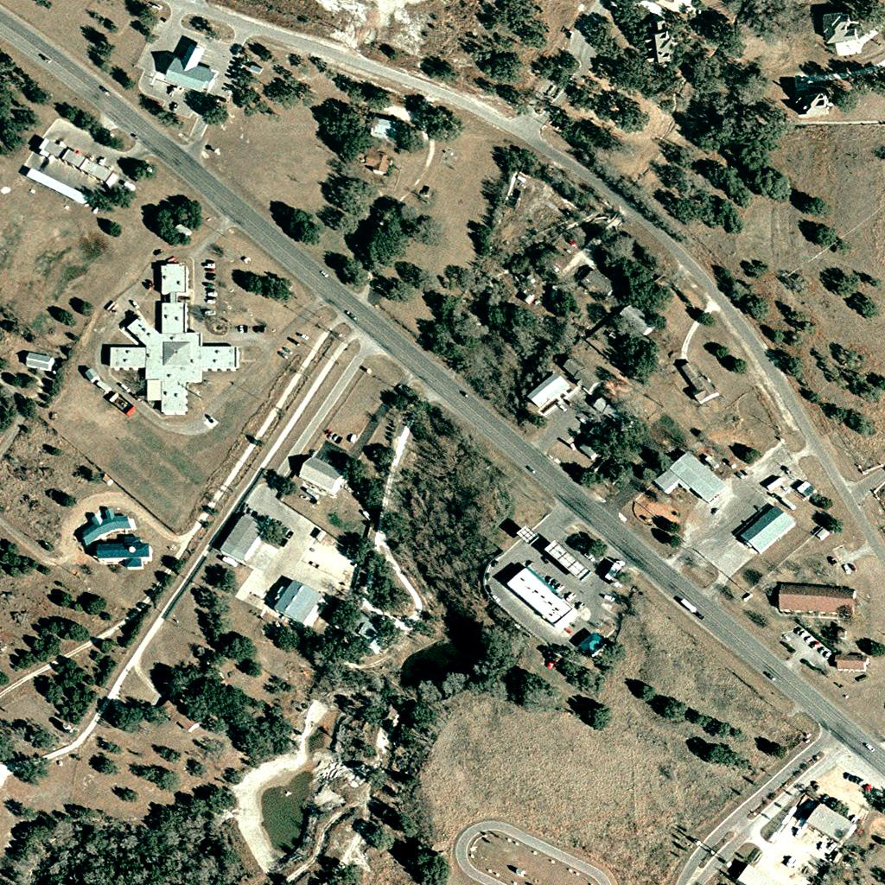
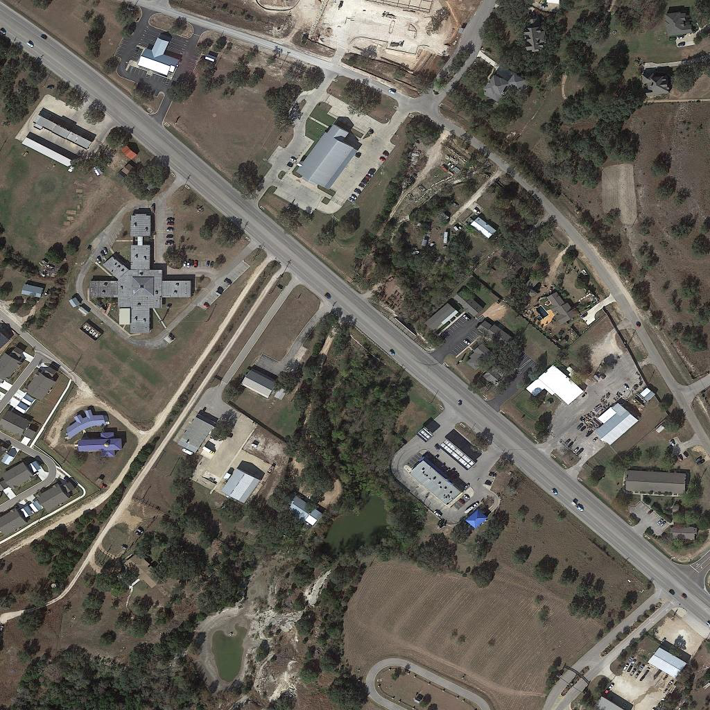

# Satellite Change Detection using Deep Learning

This project implements a **deep learning model for detecting changes
between multi-temporal satellite images**. The model takes two satellite
images captured at different times and predicts a **change map**
highlighting regions where significant changes occurred.

This type of system is widely used in **remote sensing, environmental
monitoring, disaster assessment, and urban development analysis**.

------------------------------------------------------------------------

# Project Overview

Satellite imagery change detection is an important problem in **computer
vision and geospatial analysis**. By comparing satellite images taken at
different time periods, we can detect:

-   Urban expansion
-   Deforestation
-   Infrastructure development
-   Natural disaster damage
-   Water body changes

This project uses a **Siamese Convolutional Neural Network (CNN)**
architecture to extract features from two satellite images and compute a
difference map to identify changed regions.

------------------------------------------------------------------------

# Model Architecture

The system uses a **shared encoder (Siamese CNN)** to process both
images.

            Image A ──► CNN Encoder ──┐
                                       ├── Feature Difference ──► Decoder ──► Change Map
            Image B ──► CNN Encoder ──┘

### Steps

1.  Extract features from both images using the same CNN encoder\
2.  Compute the **absolute difference** between feature maps\
3.  Pass the difference through a decoder\
4.  Output a **binary change mask**

------------------------------------------------------------------------

# Dataset

The model is trained on the **LEVIR-CD dataset**, a widely used
benchmark dataset for satellite change detection.

### Dataset Characteristics

-   High-resolution aerial images
-   Image pairs captured at different times
-   Pixel-level change annotations

Dataset link:

https://drive.google.com/drive/folders/1dLuzldMRmbBNKPpUkX8Z53hi6NHLrWim

------------------------------------------------------------------------

# Project Structure

    satellite-change-detection
    │
    ├── dataset.py
    ├── model.py
    ├── train.py
    ├── predict.py
    ├── requirements.txt
    ├── sample_results/
    └── README.md

------------------------------------------------------------------------

# Installation

Clone the repository:

``` bash
git clone https://github.com/yashdeep-rai/satellite-change-detection.git
cd satellite-change-detection
```

Install dependencies:

``` bash
pip install torch torchvision opencv-python matplotlib
```

------------------------------------------------------------------------

# Training

Place the dataset inside the project directory and run:

``` bash
python train.py
```

------------------------------------------------------------------------

# Inference

To generate a change map for a new pair of images:

``` bash
python predict.py
```

The output will be a **binary change map** highlighting regions where
significant changes occurred.

------------------------------------------------------------------------

# Example Results

  -----------------------------------------------------------------------------------------------------
  Before                           After                           Change Map
  -------------------------------- ------------------------------- ------------------------------------
        

  -----------------------------------------------------------------------------------------------------

------------------------------------------------------------------------

# Technologies Used

-   Python
-   PyTorch
-   OpenCV
-   NumPy

------------------------------------------------------------------------

# Applications

This approach can be applied to:

-   Environmental monitoring
-   Disaster damage assessment
-   Urban growth analysis
-   Agricultural monitoring
-   Land use classification

------------------------------------------------------------------------

# Author

**Yashdeep**\
B.Tech Computer Science and Engineering\
IIITDM Kurnool

GitHub: https://github.com/yashdeep-rai \
Email: yashdeep677@gmail.com
